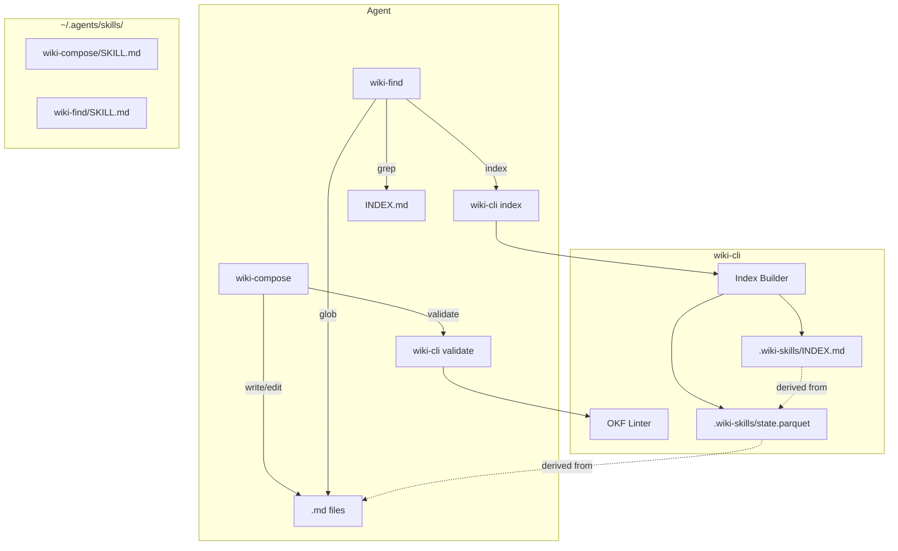
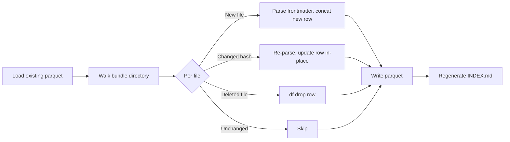

# wiki-skills — Engineering Design Document

## 1. Overview

**wiki-skills** is a Python CLI and agent-skill package that enables AI agents to read, write, navigate, and validate large wikis in the [Open Knowledge Format (OKF)](https://openknowledgeformat.com/).

The primary caller is an **AI agent**, not a human. The CLI exposes a small set of subcommands — `install`, `index`, and `validate` — while bundled skills (`wiki-compose`, `wiki-find`) encode the agent workflows for composing and searching wiki content.

### Key Properties

| Property | Value |
|---|---|
| Python | `>=3.11` |
| Build system | hatchling |
| CLI framework | `fire` |
| Logging | `loguru` |
| Markdown parsing | `markdown-it-py` |
| State/cache | pandas DataFrame → Parquet |
| Query model | grep + glob (no custom query engine) |

## 2. Scope

### In Scope

- OKF metadata representation as Python `TypedDict`
- `wiki-cli` entry point with `install`, `index`, `validate` subcommands
- Incremental index rebuild (parquet state → markdown output)
- OKF conformance linter (ruff-style output)
- Bundled agent skills: `wiki-compose`, `wiki-find`
- `--target` configurable install directory for skills

### Non-Goals (Out of Scope)

- Custom query engine or SQL interface
- SQLite / FTS5 full-text search
- JSONL output format (can be added later as `--format`)
- Web UI or API server
- Real-time file watching / auto-reindex
- Multi-wiki federation or remote bundle support

## 3. Architecture



### Module Layout

```
src/wiki_skills/
├── __about__.py          # version
├── __init__.py
├── wiki.py               # OKF metadata types + constants
├── cli.py                # fire CLI entry point
├── index.py              # parquet state + INDEX.md generation
├── validate.py           # OKF conformance linter
└── skills/               # bundled SKILL.md + supporting files
    ├── wiki-compose/
    │   └── SKILL.md
    └── wiki-find/
        └── SKILL.md
```

## 4. OKF Data Structures

### Python Representation

```python
from __future__ import annotations

from typing import NotRequired, TypedDict


class ConceptMetadata(TypedDict, total=False):
    """OKF frontmatter for a concept document."""

    type: str                     # REQUIRED — non-empty
    title: NotRequired[str]
    description: NotRequired[str]
    resource: NotRequired[str]
    tags: NotRequired[list[str]]
    timestamp: NotRequired[str]   # ISO 8601
```

**Convention:** `type` is the only required field. All other keys are optional. Consumers must preserve unknown keys.

### Directory Layout

```
bundle-root/
├── index.md          # type=index (reserved)
├── log.md            # type=log (reserved)
├── users.md          # concept
├── tables/
│   ├── index.md      # type=index (reserved)
│   ├── users.md      # concept
│   └── orders.md     # concept
└── .wiki-skills/     # generated state
    ├── state.parquet
    └── INDEX.md
```

### Concept ID

File path relative to bundle root, minus `.md` extension.

| File | Concept ID |
|---|---|
| `tables/users.md` | `tables/users` |
| `users.md` | `users` |

### Conformance Rules

| Rule | Severity | Description |
|---|---|---|
| Missing `type` | ERROR | Every non-reserved `.md` must have non-empty `type` in frontmatter |
| Invalid frontmatter | ERROR | YAML cannot be parsed |
| Bad timestamp format | WARN | Not ISO 8601 |
| Bad tags format | WARN | Not a list of strings |
| Empty bundle | WARN | No concept files found |
| Index stale | WARN | `.wiki-skills/INDEX.md` out of date or missing |

Consumers MUST NOT reject for: missing optional fields, unknown types/keys, broken links, or missing `index.md`.

## 5. CLI — `wiki-cli`

### Entry Point

```python
# cli.py
import fire
from wiki_skills.validate import validate
from wiki_skills.index import index
from wiki_skills.install import install


def main() -> None:
    fire.Fire({
        "install": install,
        "index": index,
        "validate": validate,
    })
```

### Subcommands

#### `wiki-cli install`

Copy bundled skills to the agent skills directory.

| Flag | Default | Description |
|---|---|---|
| `--target` | `~/.agents/skills/` | Destination directory |

#### `wiki-cli index`

Walk OKF bundle, parse frontmatter, write parquet state + INDEX.md.

```
wiki-cli index                 # indexes CWD as wiki root
wiki-cli index ./my-wiki       # indexes specific bundle
```

| Flag | Default | Description |
|---|---|---|
| `[path]` | CWD | Wiki root directory |

Output:
- `.wiki-skills/state.parquet` — structured cache
- `.wiki-skills/INDEX.md` — grep-friendly index

#### `wiki-cli validate`

Lint OKF bundle for conformance. Ruff-style stdout output.

```
wiki-cli validate              # validates CWD
wiki-cli validate ./my-wiki    # validates specific bundle
```

Exit codes:
- `0` — clean
- `1` — warnings only
- `2` — errors present

## 6. Index Strategy

### State: Parquet

`state.parquet` is a pandas DataFrame with columns:

| Column | Type | Notes |
|---|---|---|
| `path` | `str` | Relative path from bundle root |
| `type` | `str` | From frontmatter `type` field |
| `title` | `str` | Optional — empty string if absent |
| `description` | `str` | Optional — empty string if absent |
| `resource` | `str` | Optional — empty string if absent |
| `tags` | `list[str]` | Parquet list column |
| `timestamp` | `str` | ISO 8601 — empty string if absent |
| `content_hash` | `str` | SHA-256 of file content for incremental builds |

Sorted by: `path`, `type`, `timestamp`.

### Incremental Rebuild



### Output: INDEX.md

Three grep-friendly sections:

```markdown
# Wiki Index

## Table

| Path | Type | Title | Tags | Timestamp |
|---|---|---|---|---|
| concepts/tables.md | concept | Tables | schema, db | 2026-07-01 |
| concepts/tables/users.md | concept | Users Table | schema, db | 2026-07-02 |

## Documents by Tags

### tag :: db
- concepts/tables.md
- concepts/tables/users.md

### tag :: schema
- concepts/tables.md
- concepts/tables/users.md

## Documents by Types

### type :: concept
- concepts/tables.md
- concepts/tables/users.md

### type :: index
- concepts/index.md
```

### Agent Grep Patterns

| Pattern | Result |
|---|---|
| `grep "type :: concept" INDEX.md` | All concept files |
| `grep "tag :: db" INDEX.md` | All files tagged "db" |
| `grep "\| concept \|" INDEX.md` | Concept rows in table |

## 7. Bundled Skills

### wiki-compose

**Purpose:** Write or edit wiki content using OKF format.

**Workflow:**
1. Agent reads OKF data structures from skill reference
2. Agent writes/edits `.md` files with correct frontmatter
3. Agent runs `wiki-cli validate [path]` to check conformance
4. If errors, agent fixes and re-validates

### wiki-find

**Purpose:** Find document paths by metadata (type, tags, etc.).

**Workflow:**
1. Agent runs `wiki-cli index [path]` to build/update INDEX.md
2. Agent uses `grep` on INDEX.md to search by type, tag, or content
3. Agent uses `glob` on matching paths to open actual files

## 8. Alternatives Considered

| Choice | Rejection Reason |
|---|---|
| SQLite + FTS5 | Over-engineered for AI agent caller. Agents have grep/glob. Adds FTS5 tokenizer, WAL mode, schema migration complexity with no payoff. |
| INDEX.md as cache (parse-and-diff) | Couples output format to rebuild logic. Cleaner to have structured state (parquet) and derive output. |
| JSON state file | Slower reads at scale, no columnar access. Parquet gives in-place row updates and fast I/O. |
| Flag-based `search` subcommand | Hits ceiling on complex queries. Flag→SQL translation is maintenance for a caller that doesn't need the abstraction. |
| `search --sql` passthrough | Two modes in one command creates ambiguity. Doubled error surface. |
| Hardcoded install directory | Rejected in favor of configurable `--target` with default. More agent-agnostic. |
| JSONL output format | Deferred — markdown table sufficient and more human-readable. Can add `--format jsonl` later. |
| Comma-separated tags string | Replaced with `list[str]` in parquet. Avoids delimiter ambiguity with multi-word tags. |

## 9. OKF Spec References

- **Canonical spec:** https://github.com/GoogleCloudPlatform/knowledge-catalog/blob/main/okf/SPEC.md
- **Blog:** https://cloud.google.com/blog/products/data-analytics/how-the-open-knowledge-format-can-improve-data-sharing
- **Community guide:** https://openknowledgeformat.com/
