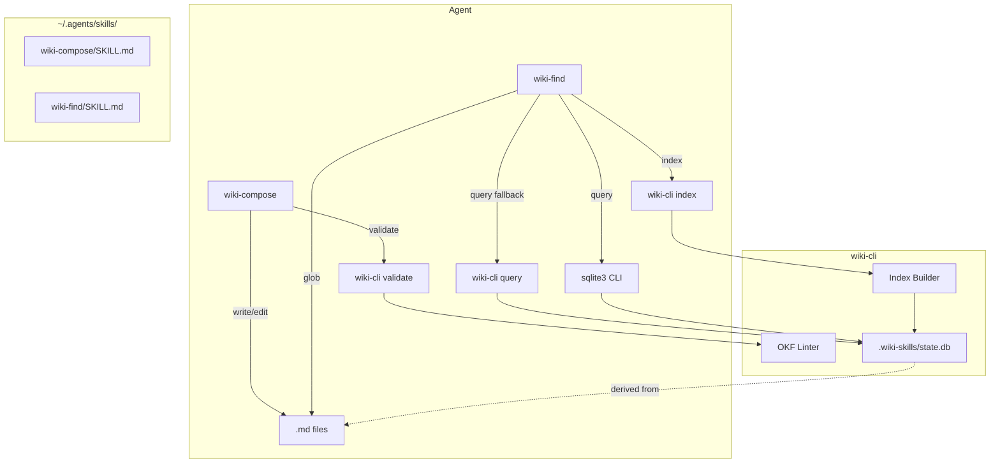
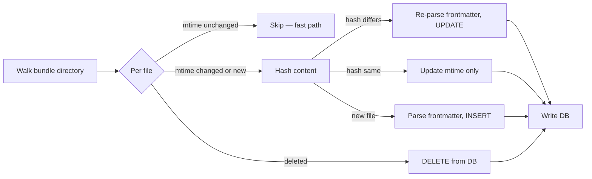

# wiki-skills — Engineering Design Document

## 1. Overview

**wiki-skills** is a Python CLI and agent-skill package that enables AI agents to read, write, navigate, and validate large wikis in the [Open Knowledge Format (OKF)](https://openknowledgeformat.com/).

The primary caller is an **AI agent**, not a human. The CLI exposes a small set of subcommands — `install`, `index`, `validate`, and `query` — while bundled skills (`wiki-compose`, `wiki-find`) encode the agent workflows for composing and searching wiki content.

### Key Properties

| Property | Value |
|---|---|
| Python | `>=3.11` |
| Build system | hatchling |
| CLI framework | `fire` |
| Logging | `loguru` |
| Markdown parsing | `markdown-it-py` |
| State/cache | SQLite (`state.db`) |
| Query model | `sqlite3` CLI or `wiki-cli query` fallback |

## 2. Scope

### In Scope

- OKF metadata representation as Python `TypedDict`
- `wiki-cli` entry point with `install`, `index`, `validate`, `query` subcommands
- SQLite state with content-hash incremental rebuild
- OKF conformance linter (ruff-style output)
- Bundled agent skills: `wiki-compose`, `wiki-find`
- `--target` configurable install directory for skills
- CLI dependency checks (`sqlite3`, `grep`)

### Non-Goals (Out of Scope)

- SQLite FTS5 full-text search
- JSONL output format (can be added later as `--format`)
- Web UI or API server
- Real-time file watching / auto-reindex
- Multi-wiki federation or remote bundle support

## 3. Architecture



### Module Layout

```
src/wiki_skills/
├── __about__.py          # version
├── __init__.py
├── wiki.py               # OKF metadata types + constants
├── cli.py                # fire CLI entry point
├── index.py              # SQLite state + incremental rebuild
├── validate.py           # OKF conformance linter
├── query.py              # SQL execution fallback (Python sqlite3)
├── deps.py               # CLI dependency checks (check_cli)
└── skills/               # bundled SKILL.md + supporting files
    ├── wiki-compose/
    │   └── SKILL.md
    └── wiki-find/
        └── SKILL.md
```

## 4. OKF Data Structures

### Python Representation

```python
from __future__ import annotations

from typing import NotRequired, TypedDict


class ConceptMetadata(TypedDict, total=False):
    """OKF frontmatter for a concept document."""

    type: str                     # REQUIRED — non-empty
    title: NotRequired[str]
    description: NotRequired[str]
    resource: NotRequired[str]
    tags: NotRequired[list[str]]
    timestamp: NotRequired[str]   # ISO 8601
```

**Convention:** `type` is the only required field. All other keys are optional. Consumers must preserve unknown keys.

### Directory Layout

```
bundle-root/
├── index.md          # type=index (reserved)
├── log.md            # type=log (reserved)
├── users.md          # concept
├── tables/
│   ├── index.md      # type=index (reserved)
│   ├── users.md      # concept
│   └── orders.md     # concept
└── .wiki-skills/     # generated state
    └── state.db      # SQLite database (sole cache)
```

### Concept ID

File path relative to bundle root, minus `.md` extension.

| File | Concept ID |
|---|---|
| `tables/users.md` | `tables/users` |
| `users.md` | `users` |

### Conformance Rules

| Rule | Severity | Description |
|---|---|---|
| Missing `type` | ERROR | Every non-reserved `.md` must have non-empty `type` in frontmatter |
| Invalid frontmatter | ERROR | YAML cannot be parsed |
| Bad timestamp format | WARN | Not ISO 8601 |
| Bad tags format | WARN | Not a list of strings |
| Empty bundle | WARN | No concept files found |
| DB stale | WARN | `state.db` out of date (detected via mtime comparison) |

Consumers MUST NOT reject for: missing optional fields, unknown types/keys, broken links, or missing `index.md`.

## 5. CLI — `wiki-cli`

### Entry Point

```python
# cli.py
import fire
from wiki_skills.validate import validate
from wiki_skills.index import index
from wiki_skills.install import install
from wiki_skills.query import query


def main() -> None:
    fire.Fire({
        "install": install,
        "index": index,
        "validate": validate,
        "query": query,
    })
```

### Subcommands

#### `wiki-cli install`

Copy bundled skills to the agent skills directory.

| Flag | Default | Description |
|---|---|---|
| `--target` | `~/.agents/skills/` | Destination directory |

#### `wiki-cli index`

Walk OKF bundle, parse frontmatter, write SQLite state.

```
wiki-cli index                 # indexes CWD as wiki root (incremental via content hashing)
wiki-cli index ./my-wiki       # indexes specific bundle
wiki-cli index --full          # forces complete rebuild (skips mtime optimization)
```

| Flag | Default | Description |
|---|---|---|
| `[path]` | CWD | Wiki root directory |
| `--full` | `False` | Force complete rebuild (skip mtime optimization) |

Output:
- `.wiki-skills/state.db` — SQLite database (sole cache)

#### `wiki-cli validate`

Lint OKF bundle for conformance. Ruff-style stdout output.

```
wiki-cli validate              # validates CWD
wiki-cli validate ./my-wiki    # validates specific bundle
```

Exit codes:
- `0` — clean
- `1` — warnings only
- `2` — errors present

**Staleness detection:** `validate` checks if `state.db` is stale by comparing file mtimes in the DB against current filesystem mtimes. If any file's mtime is newer than what's stored, emit WARN: `WARN — state.db is stale, run 'wiki-cli index' to update`.

**DB freshness check:** If `state.db` does not exist, emit WARN: `WARN — state.db not found, run 'wiki-cli index' first`.

#### `wiki-cli query`

Execute SQL against `state.db`. Fallback for when `sqlite3` CLI is unavailable.

```
wiki-cli query "SELECT path FROM files WHERE type = 'concept'"
wiki-cli query --db ./my-wiki/.wiki-skills/state.db "SELECT * FROM files"
```

| Flag | Default | Description |
|---|---|---|
| `--db` | `<bundle>/.wiki-skills/state.db` | Path to SQLite database |
| `SQL` (positional) | required | SQL query to execute |

Uses Python's built-in `sqlite3` module — no external dependencies.

### CLI Dependency Checks

**Utility function:** `check_cli(name: str) -> bool` — wraps `shutil.which()` to verify a CLI tool is available on PATH.

| CLI | Required by | Fallback |
|---|---|---|
| `sqlite3` | `index`, `validate` | Warn + agents use `wiki-cli query` instead |
| `grep` | Agent workflows (via bundled skills) | No fallback — agent's responsibility |

**Startup behavior:** `index` and `validate` call `check_cli("sqlite3")` first. If missing, log warning: `WARN — sqlite3 CLI not found, use 'wiki-cli query' to search state.db`.

**Note:** `git` is NOT required. Content hashing handles change detection regardless of version control.

## 6. Index Strategy

### State: SQLite

`state.db` is a SQLite database with a single table:

```sql
CREATE TABLE files (
    path TEXT PRIMARY KEY,
    type TEXT NOT NULL,
    title TEXT,
    description TEXT,
    resource TEXT,
    tags TEXT,          -- JSON array: '["db","schema"]'
    timestamp TEXT,
    content_hash TEXT NOT NULL,  -- SHA-256 of file content
    mtime REAL NOT NULL         -- file modification time (float, epoch seconds)
);
```

### Agent Query Workflow

Agents query the database directly using `sqlite3` CLI:

```bash
# Find all concept files
sqlite3 .wiki-skills/state.db "SELECT path FROM files WHERE type = 'concept'"

# Find files tagged "db"
sqlite3 .wiki-skills/state.db "SELECT path FROM files WHERE tags LIKE '%db%'"

# Search descriptions
sqlite3 .wiki-skills/state.db "SELECT path, description FROM files WHERE description LIKE '%users%'"
```

If `sqlite3` CLI is unavailable, agents fall back to `wiki-cli query`:

```bash
wiki-cli query "SELECT path FROM files WHERE type = 'concept'"
```

No index regeneration needed — the DB is always current after `wiki-cli index`.

### Incremental Rebuild (Content Hashing)

No git dependency for change detection. Uses `content_hash` (SHA-256) and `mtime` stored per file:



1. Walk bundle directory, collect all `.md` files with current `mtime`
2. For each file: if `mtime` unchanged since last index → skip (fast path)
3. If `mtime` changed or file is new → re-hash content, compare against stored `content_hash`
4. Hash differs → re-parse frontmatter, `UPDATE` row
5. New file → parse frontmatter, `INSERT` row
6. Deleted file (in DB but not on disk) → `DELETE` row

### Complete Rebuild (`--full`)

Same content hashing logic, but skips the mtime optimization — re-hashes every file. Used when `--full` flag is passed.

## 7. Bundled Skills

### wiki-compose

**Purpose:** Write or edit wiki content using OKF format.

**Workflow:**
1. Agent reads OKF data structures from skill reference
2. Agent writes/edits `.md` files with correct frontmatter
3. Agent runs `wiki-cli validate [path]` to check conformance
4. If errors, agent fixes and re-validates

### wiki-find

**Purpose:** Find document paths by metadata (type, tags, etc.).

**Workflow:**
1. Agent runs `wiki-cli index [path]` to build/update state.db
2. Agent checks if `sqlite3` CLI is available (`which sqlite3`)
3. If available: agent uses `sqlite3` CLI to query state.db directly
4. If not: agent uses `wiki-cli query "SQL"` as fallback
5. Agent uses `glob` on matching paths to open actual files

**SKILL.md instruction:** Will tell agent to prefer `sqlite3` CLI when available, fall back to `wiki-cli query`.

## 8. Alternatives Considered

| Choice | Rejection Reason |
|---|---|
| SQLite + FTS5 | Full-text search is over-engineered for the actual workload. Agents can compose `sqlite3` queries + `grep` for content search. FTS5 adds tokenizer config complexity with no payoff. |
| INDEX.md as cache | Redundant with SQLite state. Agents can query `state.db` directly via `sqlite3` CLI. No need to regenerate a markdown file that duplicates the same data. |
| Parquet state (pandas) | Immutable columnar format requires full file rewrite on every row change. No stdlib support, adds pyarrow/fastparquet dependency (~50MB). Worse manual inspection story. SQLite gives native row-level CRUD, stdlib access, and `sqlite3` CLI for ad-hoc queries. |
| JSON state file | Slower reads at scale, no columnar access, no standard query language. |
| Flag-based `search` subcommand | Hits ceiling on complex queries (OR, joins, aggregations). Flag→SQL translation is maintenance for a caller that doesn't need the abstraction. Agents compose sqlite3 queries natively. |
| Git-based incremental rebuild | All `git diff` commands are anchored to `HEAD`. If user doesn't commit between index runs, `HEAD` never moves — unstaged and staged-only changes are invisible. Content hashing is simpler and handles all edge cases. |

## 9. OKF Spec References

- **Canonical spec:** https://github.com/GoogleCloudPlatform/knowledge-catalog/blob/main/okf/SPEC.md
- **Blog:** https://cloud.google.com/blog/products/data-analytics/how-the-open-knowledge-format-can-improve-data-sharing
- **Community guide:** https://openknowledgeformat.com/
